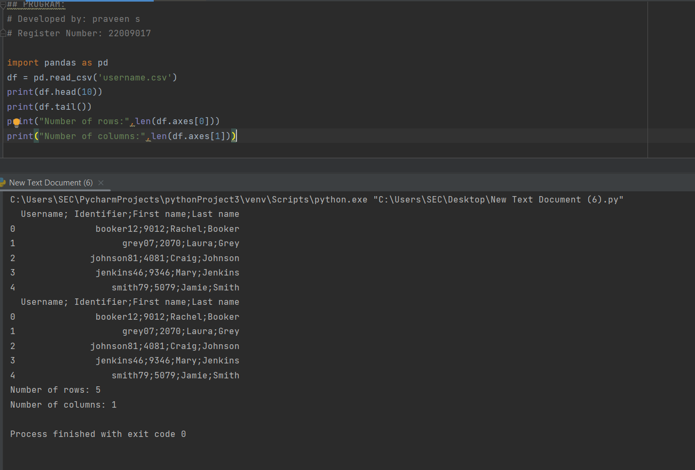

# Read-from-CSV

## AIM:

## ALGORITHM:
### Step 1:
Import the required csv file.
### Step 2:
Import pandas
### Step 3:
Read the csv file by using df.read.
### Step 4:
Display the Columns and Display the Rows.
### Step 5:
End the program
## PROGRAM:
```
# Developed by: praveen s
# Register Number: 22009017

import pandas as pd
df = pd.read_csv('username.csv')
print(df.head(10))
print(df.tail())
print("Number of rows:",len(df.axes[0]))
print("Number of columns:",len(df.axes[1]))
```


## OUTPUT:


## RESULT:
Therefore the program is successfully executed to read csv file and access the data in it.
